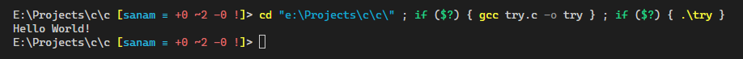
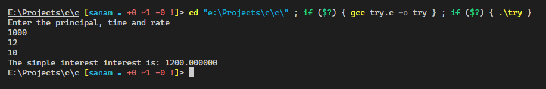
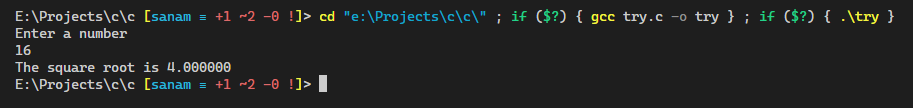

# C Programming Reference

C is a general-purpose computer programming language. It was created in the 1970s by Dennis Ritchie, and remains very widely used and influential. [Wikipedia](<https://en.wikipedia.org/wiki/C_(programming_language)>)

## Table of contents

- [Learn C](#learn-c)
  - [Basic](#basic)
- [Write a program (WAP)](#write-a-program-wap)
  - [WAP to print Hello World](#wap-to-print-hello-world)

### Learn C

#### Basic

[C Tutorial - W3Schools](https://www.w3schools.com/c/index.php)

### Write a program (WAP)

#### WAP to print Hello World

```c
#include <stdio.h>

int main()
{
    printf("Hello World!\n");
    return 0;
}
```

<details><summary>See output</summary>



</details>

#### WAP to calculate the simple interest using user defined function

```c
#include <stdio.h>

// user defined function
float calc_simple_interest(float p, float t, float r)
{
    return ((p * t * r) / 100);
}

// main function
int main()
{
    float p, t, r, si;
    printf("Enter the principal, time and rate\n");
    scanf("%f%f%f", &p, &t, &r);

    si = calc_simple_interest(p, t, r);
    printf("The simple interest interest is: %f", si);
    return 0;
}
```

<details><summary>See output</summary>



</details>

#### WAP to input any number and find the square root of that number using user defined function

```c
#include <stdio.h>
#include <math.h>

// user defined function
double find_square_root(double n)
{
    return sqrt(n);
}

// main function
int main()
{
    double number, sqrt;
    printf("Enter a number\n");
    scanf("%lf", &number);

    sqrt = find_square_root(number);
    printf("The square root is %lf", sqrt);
    return 0;
}

```

<details><summary>See output</summary>



</details>
