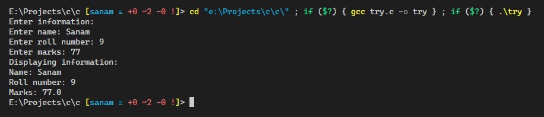
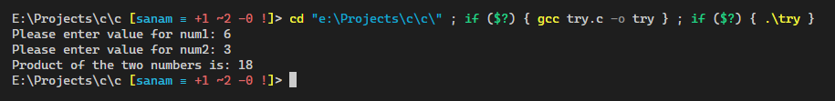

# C Programming Reference

C is a general-purpose computer programming language. It was created in the 1970s by Dennis Ritchie, and remains very widely used and influential. [Wikipedia](<https://en.wikipedia.org/wiki/C_(programming_language)>)

## Table of contents

- [Learn C](#learn-c)
  - [Basic](#basic)
- [Write a program (WAP)](#write-a-program-wap)
  - [WAP to print Hello World](#wap-to-print-hello-world)
  - [WAP to calculate the simple interest using user defined function](#wap-to-calculate-the-simple-interest-using-user-defined-function)
  - [WAP to input any number and find the square root of that number using user defined function](#wap-to-input-any-number-and-find-the-square-root-of-that-number-using-user-defined-function)
  - [WAP to store and display information of a student using structure](#wap-to-store-and-display-information-of-a-student-using-structure)
  - [WAP to read two numbers and find product using pointer](#wap-to-read-two-numbers-and-find-product-using-pointer)

### Learn C

#### Basic

[C Tutorial - W3Schools](https://www.w3schools.com/c/index.php)

### Write a program (WAP)

#### WAP to print Hello World

```c
#include <stdio.h>

int main()
{
    printf("Hello World!\n");
    return 0;
}
```

<details><summary>See output</summary>


</details>

#### WAP to calculate the simple interest using user defined function

```c
#include <stdio.h>

// user defined function
float calc_simple_interest(float p, float t, float r)
{
    return ((p * t * r) / 100);
}

// main function
int main()
{
    float p, t, r, si;
    printf("Enter the principal, time and rate\n");
    scanf("%f%f%f", &p, &t, &r);

    si = calc_simple_interest(p, t, r);
    printf("The simple interest interest is: %f", si);
    return 0;
}
```

<details><summary>See output</summary>


</details>

#### WAP to input any number and find the square root of that number using user defined function

```c
#include <stdio.h>
#include <math.h>

// user defined function
double find_square_root(double n)
{
    return sqrt(n);
}

// main function
int main()
{
    double number, sqrt;
    printf("Enter a number\n");
    scanf("%lf", &number);

    sqrt = find_square_root(number);
    printf("The square root is %lf", sqrt);
    return 0;
}
```

<details><summary>See output</summary>


</details>

#### WAP to store and display information of a student using structure

```c
#include <stdio.h>
struct student
{
    char name[50];
    int roll;
    float marks;
} s;

int main()
{
    printf("Enter information:\n");
    printf("Enter name: ");
    fgets(s.name, sizeof(s.name), stdin);

    printf("Enter roll number: ");
    scanf("%d", &s.roll);
    printf("Enter marks: ");
    scanf("%f", &s.marks);

    printf("Displaying information:\n");
    printf("Name: ");
    printf("%s", s.name);
    printf("Roll number: %d\n", s.roll);
    printf("Marks: %.1f\n", s.marks);

    return 0;
}
```

<details><summary>See output</summary>



</details>

#### WAP to read two numbers and find product using pointer

```c
#include <stdio.h>

int main()
{
    int num1, num2;
    int *ptr1, *ptr2;
    int mul;

    printf("Please enter value for num1: ");
    scanf("%d", &num1);
    printf("Please enter value for num2: ");
    scanf("%d", &num2);

    ptr1 = &num1;
    ptr2 = &num2;
    mul = *ptr1 * *ptr2;

    printf("Product of the two numbers is: %d", mul);
    return 0;
}
```

<details><summary>See output</summary>



</details>
